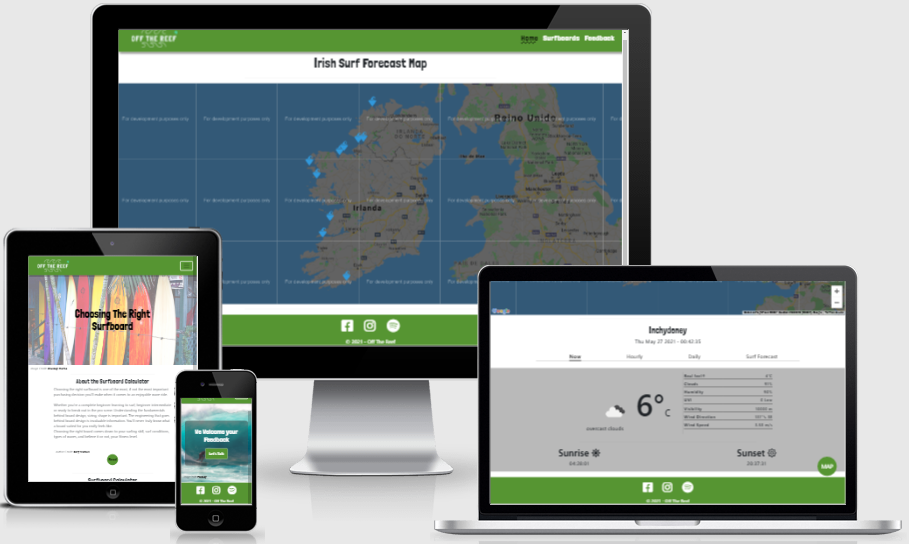

# Off The Reef | Surf Forecast
---

Welcome,

Off the Reef is a surf forecast webpage, is a collection of meteorological data combined with complex algorithms and swell models to predict local surf conditions in advance.
All designed to assist surfers in understanding what surf conditions can be expected at their local surf spot, displayed in a way that is easily digestible and quick to understand.

[Click here to see the project live](https://sanclerzanella.github.io/off_the_reef_project/)

## UX
---
### The purpose of the website is to present the follow values:
  * Get details about the meterological conditions of different surf spots in Ireland.
  * displayed weather, waves and tide information in a way that is easily digestible and quick to understand.
  * Create a resposive design, wich works in different screen sizes and devices, due the fact that people use more mobile devices nowadays.

### User Stories:
  1. I am a local surfer who checks the surf and weather condition every weekend from my computer before get the beach to surf.

  2. I am a beginner surfer who seeks for an advice how to choose the right surf board and the place with the best waves for a beginner.

  3. I am  a tourist who seeks information about the surf spots from my phone, intending improve my surf trip.

### Design Process:
  * I began the design process by outlining the key features that I wanted my website to have and thought about what might be the most intuitive way to navigate through each page. This led me to decide on the four pages I would have on my website: 'Home', 'Surfboards'and 'Feedback'.

  * In the same way, I decided set a map as a navigation over the surf spots with a info window and a link for a full report. 

  * In the report section I set a navigation bar (Now, Hourly, Daily and Surf Forecast) in order to facilitate the navigation through the diferent parts of the report. 

  * I decided to apply breadcrumbs in the album pages to provide an easily navigation, the breadcrumb link go exactly to the point where the user was in the page before click in the link. 

  * The layout changes in different screen sizes, I chose for take out some content in smaller screens to the content fits well in these smaller screens, but the main content still in the website, and I changed The rows and columns arrangement to fit the content well.

### Wireframing my project on Balsamiq

  * The wireframe can be seen here: [Wireframe]()

---
## Features
### Existing Features

This project has, at least, three separated pages, the three pages can be found by clicking on the corresponding name on the menu.

#### Consistent features across all pages

  * A navigation bar on the top of each page with The brand logo on the middle (which leads a user back to 'Home' when clicked) and three links, one to home page, and another to Surfboards page, and the last to Feedback page. When in medium and small screens the navigation bar changes, the logo goes to the left side and the menu to the right side in a collpased form.

  * The footer is also consistent across all pages with links to social media profiles there and copyrights.

#### Home page

  * There is a map with surf spots and a info window for each spot with a link to the full report.

  * There is a local report with a navigation bar, with 'Now' (current weather report), 'Hourly', 'Daily' and 'Surf Forecast'.

#### Surfboards page

  * There is a Cover image with a title over the image.

  * There is a text which explains the surfboard calculator, that can be expanded or hide.

  * There is form which fetch the essential data for the result (like weight, age, surf ability level, fitness condition, prefered surfboard style).

  * There is a section which prints the result on screen.

#### Feedback page

  * There is a background image.

  * There is a button which opens a modal with a form.

  * There is a contact form.

### Future Features

  * Add a shopping suggestion section to the surfboards page using an API like amazon, ebay or google shopping.

  * Add more surf spots.

  * Add more hours on hourly and surf forecast report.

---
## Technologies Used

  * [HTML 5](https://en.wikipedia.org/wiki/HTML5)
    * The language used to build the structure and add its content.

  * [CSS3](https://en.wikipedia.org/wiki/CSS)
    * The language used to style the HTML5 elements according to the design and color scheme.

  * [Bootstrap framework](https://getbootstrap.com/)
    * I decided to use Bootstrap's grid container system as I wanted to design my project with a 'mobile first' approach, but another bootstrap resources were used like the contact form.

  * [JavaScript](https://www.javascript.com/)
    * JavaScript, often abbreviated as JS, is a programming language that conforms to the ECMAScript specification.JavaScript is high-level, often just-in-time compiled, and multi-paradigm. 

  * [Jquery](https://api.jquery.com/)
    * jQuery is a fast, small, and feature-rich JavaScript library. It makes things like HTML document traversal and manipulation, event handling, animation, and Ajax much simpler with an easy-to-use API that works across a multitude of browsers.

  * [Balsamiq](https://balsamiq.com/)
    * Balsamiq helped me crystalise my design ideas, creating the layout structure.

  * [FontAwesome](https://fontawesome.com/)
    * FontAwesome icons is where I got most part of the icons for my design project.

  * [Google Fonts](https://fonts.google.com/)
    * I used Google fonts to provide the fonts of the website.

  * [Google Maps API](https://developers.google.com/maps/documentation/javascript/overview)
    * I used to provide the interactive map on Home page.

  * [Chrome Dev Tools](https://developers.google.com/web/tools/chrome-devtools)
    * A set of web developer tools built directly into the Google Chrome browser. I used these tools constantly thoughout the development cycle.
  
  * [GitHub](https://github.com/)
    * A company that provides hosting for software development version control using Git and publish the webpage.

  * [Gitpod](https://gitpod.io/)
    * Gitpod is an open source platform for automated and ready-to-code development environments that blends into your existing workflow directly from your browser.

  * [Visual Code Studio](https://code.visualstudio.com/)
    * Is a programming code editor created by Microsoft that I used extensively. It allows programmers to create, save and edit their code on their own pc's.

  * [Code Institute Full Template](https://github.com/Code-Institute-Org/gitpod-full-template)
    * I used as a basic template to kick start my project.

  * [Canva](https://www.canva.com/)
    * I used the Canva platform to make the style guide and logo.

  * [TinyPNG](https://tinypng.com/)
    * I used TinyPNG to compress my image files to try to reduce the loading time for each page.

  * [W3C markup validation service](https://validator.w3.org/)
    * Great tool to support throught the web development that helps to test and find issues on markup file.

  * [CSS validation service](https://jigsaw.w3.org/css-validator/)
    * Great tool to support throught the web development that helps to test and find issues on style file.

  * [W3C Schools](https://www.w3schools.com/)
    * W3C Schools is a great platform that covers all aspects of web development, great tools that provides information for developers.

  * [Stack Overflow](https://stackoverflow.com/)
    * Although it isn't a technology, I found a lot of guidance on Stack Overflow.

  * [MND Web Docs](https://developer.mozilla.org/en-US/docs/Web)
    * DN Web Docs, previously Mozilla Developer Network and formerly Mozilla Developer Center, is a documentation repository for web developers used by Mozilla, Microsoft, Google, and Samsung.

  * [CSS-tricks](https://css-tricks.com/)
    * Is a blog where you can find lots of tutorial and tricks to write a good css.

  * [OpenWeatherMap API](https://openweathermap.org/api/one-call-api)
    * OpenWeather is a team of IT experts and data scientists that has been practising deep weather data science since 2014. For each point on the globe, OpenWeather provides historical, current and forecasted weather data via light-speed APIs. Headquarters in London, UK.

  * [StormGlass API](https://docs.stormglass.io/)
    * Professional global weather API providing high-resolution forecasts directly from the world’s most trusted meteorological institutions.

  * [EmailJs API](https://www.emailjs.com/)
    * EmailJS helps to send emails using client-side technologies only. No server is required – just connect EmailJS to one of the supported email services, create an email template, and use our Javascript library to trigger an email.

  * [Pexels](https://www.pexels.com/)
    * Stunning photos and videos, sourced from a global network of talented creators, completely free to use. I used to provide the images for this webpage.

  * [introJs](https://introjs.com/docs/)
    * Intro.js is an open source vanilla Javascript / CSS library to add step-by-step introduction or hints.  

---
## Testing

### Testing User Stories

Based on the User Stories listed above:

  1. The local surfer can now have the information about the beach before leave his house, in an easy to understand way.

  2. the beginner surfer can now choose the right board and surf spot to practice. 

  3. The tourist can now safely find the best surf spots and forecast to improve his surf trip.

### Validating The HTML and CSS code
  
  * [HTML](https://validator.w3.org/)
  * [CSS](https://jigsaw.w3.org/css-validator/)

### Testing in different browsers

I manually tested the website on the following web browsers, checking that buttons, responsiveness and design worked as I planned:

  * Google Chrome
  * Mozilla Firefox
  * Microsoft Edge

### Testing responsiveness

I manually tested the live project by doing the following:
  
  * Using Google Developer Tools to view the project on devices with different screen sizes.
  * Asking for feedback from friends and family who opened and interacted with the project on their devices.

---
## Accessibility

  * Each image has an alt attribute describing the image's function
  * Each anchor tag has an aria-label attribute describing where that link goes
  * Each section has an aria-labelledby attribute
  * Content has a contrast with the background to improve the visibility
  * Contact form inputs have labels

---
## Deployment

### Deploying my project

I created my project on GitHub and used GitPod's development environment to write my code.

To make my project viewable to others, I deployed my project to GitHub Pages with the following process:

  1. I opened the 'Settings' section of my project repository in GitHub;
  2. From there, I scrolled to the 'GitHub Pages' section;
  3. Here I selected 'master branch' as my Source;
  4. This deployed my project on GitHub Pages and allowed me to share the live website with others.

Use the following link to view my live project: [Off The Reef](https://sanclerzanella.github.io/off_the_reef_project/)

More information about this process can be found on the following link: [GitHub Pages](https://docs.github.com/en/pages/getting-started-with-github-pages/configuring-a-publishing-source-for-your-github-pages-site)

## Cloning my project

If you would like to work on my project further you can clone it to your local machine using the following steps:

  1. Scroll to the top of my repository and click on the "clone or download button"
  2. Decide whether you want to clone the project using HTTPS or an SSH key and do the following:
    * HTTPS: click on the checklist icon to the right of the URL
    * SSH key: first click on 'Use SSH' then click on the same icon as above
  3. Open the 'Terminal'
  4. Change the current working directory to the location where you want the cloned directory
  5. Type 'git clone', and then paste the URL you copied earlier.
  6. Press 'Enter' to create your local clone.

You can find both the source of this information and learn more about the process on the following link: [Cloning a Repository](https://docs.github.com/en/github/creating-cloning-and-archiving-repositories/cloning-a-repository)

---
## Credits

### Acknowledgements

This project is part of the Milestone project 2 of the Code Institute.

Thank you to the following people who helped with support, inspiration and guidance at different stages in the project:

  * My mentor [Caleb Mbakwe](https://www.linkedin.com/in/calebmbakwe/?originalSubdomain=ng)
  * Code Institute Mentors and Tutors
  * Code Institute Student Care, which is always Kind
  * My class on slack
  * The supportive Code Institute community on Slack
  * My family and friends for their patience and honest critique throughout

